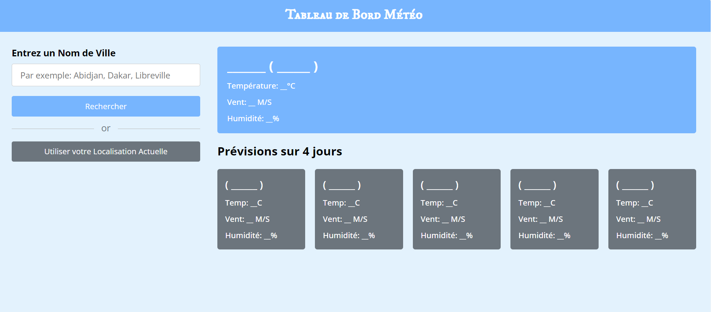

# Tableau de Bord Météo

## Description

Ce projet est un tableau de bord météorologique interactif développé en HTML, CSS et JavaScript. Il permet aux utilisateurs de rechercher les conditions météorologiques actuelles et les prévisions sur cinq jours pour n'importe quelle ville dans le monde.

## Fonctionnalités

- **Recherche de ville :** Les utilisateurs peuvent rechercher une ville spécifique par nom.
- **Localisation :** Option pour utiliser la localisation actuelle de l'utilisateur.
- **Affichage des conditions météo :** Affiche la température, la vitesse du vent, l'humidité et les conseils basés sur la température.
- **Prévisions sur cinq jours :** Affiche les prévisions météorologiques pour les cinq prochains jours avec détails.

## Outils et APIs

- **OpenWeatherMap API :** Utilisée pour obtenir les données météorologiques actuelles et les prévisions.
- **TimezoneDB API :** Pour obtenir l'heure locale basée sur les coordonnées géographiques.

## Technologies utilisées

- HTML
- CSS (avec Flexbox pour la mise en page responsive)
- JavaScript (ES6)

## Utilisation

1. Entrez le nom d'une ville dans le champ de recherche et appuyez sur "Rechercher".
2. Alternativement, cliquez sur "Utiliser la localisation actuelle" pour obtenir les prévisions météorologiques pour votre position actuelle.
3. Les informations météorologiques actuelles et les prévisions sur cinq jours seront affichées.

## Améliorations futures

- Améliorer l'interface utilisateur avec plus d'options de personnalisation.
- Ajouter la possibilité de sélectionner l'unité de température (Celsius / Fahrenheit).
- Intégrer des graphiques pour visualiser les tendances météorologiques.

Ce projet a été développé dans le cadre d'un apprentissage pratique des APIs météorologiques et des technologies web front-end. N'hésitez pas à explorer le code source et à contribuer pour l'améliorer !
